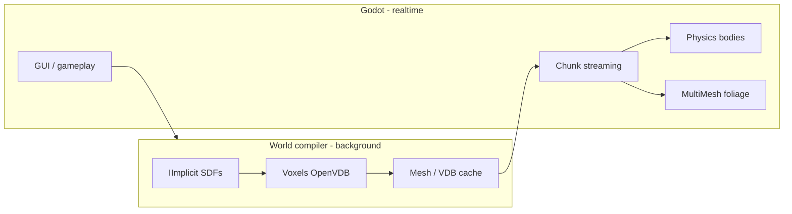
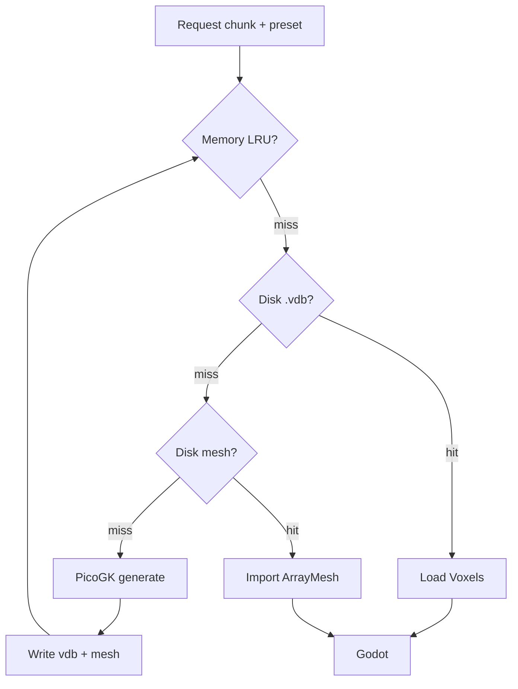
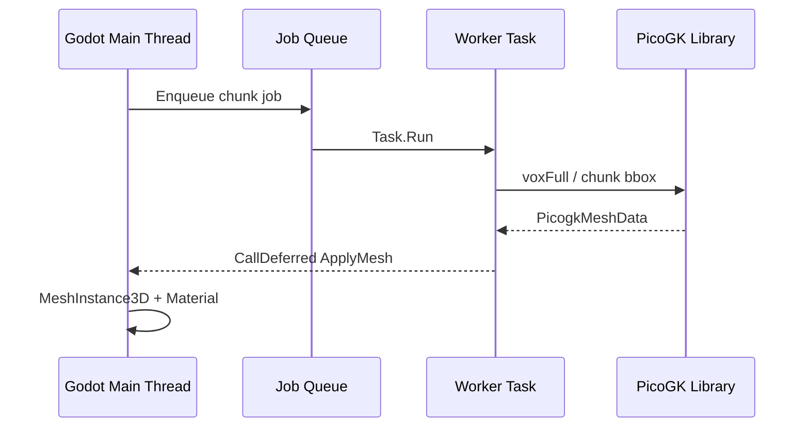

# Procedural Platform — GUI, Libraries, Caching, Chunking, Threading & Godot

Deep technical guide for turning **PicoGK + LEAP71 + PlanetTest + PicogkGodotBridge** into a production procedural platform inside Godot.

**Companion docs:** [GAME_ROADMAP.md](GAME_ROADMAP.md) (phases & game features) · [README.md](README.md) (build & PlanetTest) · [godot_demo/README.md](godot_demo/README.md) (demo usage)

---

## Table of contents

1. [Why this changes Godot procedural generation](#1-why-this-changes-godot-procedural-generation)
2. [GUI abilities (editor + runtime)](#2-gui-abilities-editor--runtime)
3. [What the libraries give you (wrap map)](#3-what-the-libraries-give-you-wrap-map)
4. [Caching](#4-caching)
5. [Hashing & deterministic worlds](#5-hashing--deterministic-worlds)
6. [Chunking & LOD](#6-chunking--lod)
7. [Multi-threading & job model](#7-multi-threading--job-model)
8. [Pipeline integration with Godot](#8-pipeline-integration-with-godot)
9. [Implementation checklist](#9-implementation-checklist)

---

## 1. Why this changes Godot procedural generation

Godot ships strong **mesh-first** tools: `FastNoiseLite`, heightmap terrain, `MeshInstance3D`, shaders, MultiMesh. It does **not** ship:

- A **signed-distance-field (SDF) geometry kernel** with robust **boolean CSG** (union / subtract / intersect)
- **Voxel-consistent** surfaces (OpenVDB-style level sets) at configurable resolution
- **Lattice / implicit TPMS** infills used in engineering meta-materials
- **Print-grade** export (STL / CLI / VDB) from the same representation you preview in-game

This repo adds that layer **without replacing Godot**:

| Godot alone | Godot + PicoGK bridge |
|-------------|------------------------|
| Heightmap = 2.5D, caves are hard | True 3D SDF: caves, overhangs, hollow shells |
| Mesh CSG in editor is fragile at scale | `Voxels` booleans are stable at fixed voxel size |
| Procedural = noise texture on a plane | Procedural = **physical volume** you mesh once, cache, stream |
| Foliage = MultiMesh on surface (good) | Same MultiMesh, but surface comes from **one truthful SDF** |
| Biome = shader tint | Biome = **same classifier** for mesh color, gameplay, spawn rules |

**“Next level”** means Godot becomes the **game shell** (input, UI, physics, networking, animation) while PicoGK becomes the **world compiler** (expensive, deterministic, cacheable). That split is how AAA engines treat terrain/mesh baking; you are doing it with open components.



---

## 2. GUI abilities (editor + runtime)

Today (`godot_demo/scripts/PlanetWorld.cs` + `addons/picogk_planet`):

| Ability | Status | Notes |
|---------|--------|-------|
| Inspector exports (radius, seed, display mode, bleed) | **Done** | Select **World** root, not child meshes |
| Regenerate Now (deferred job) | **Done** | Toggle checkbox once |
| Editor plugin menu entry | **Done** | Project → Tools → PicoGK |
| Status label + log | **Done** | Read Output panel on errors |
| Solid colored planet | **Done** | `SolidColoredPlanet` |

### 2.1 Target authoring GUI (Phase 1+)

Build a **dedicated editor dock** (`EditorPlugin`) — not only scattered `@Export` fields.

| UI region | Controls | Binds to |
|-----------|----------|----------|
| **Presets** | New / Duplicate / Save `.tres` | `WorldPreset` resource |
| **Planet** | Radius mm, voxel size, seed | `PlanetSDF.R`, `Noise.SetSeed`, `PicogkHeadlessRuntime` |
| **Noise stack** | List: name, enabled, blend, params | `Noise.cs` + future filter classes |
| **Biomes** | Table: threshold, color, priority | `BiomeColorSampler` + `PlanetSDF.eBiome` |
| **Display** | Colored solid / biomes / voxels / STL export | `PlanetBridge`, `PlanetDisplayMode` |
| **Jobs** | Progress bar, cancel, elapsed time | `IProgress` (PicoGK supports progress callbacks on heavy ops) |
| **Cache** | Show hit/miss, purge folder, rebuild chunk | Cache manager (Section 4) |
| **Debug view** | Biome heatmap, slope, moisture overlay | `SurfaceSampler` on low-res sphere |

### 2.2 Runtime GUI (in-game)

Same `WorldPreset` drives:

- New game → seed + sliders
- Loading screen → chunk queue progress
- Debug overlay (F3) → biome weights at crosshair

Use Godot `Control` scenes; bridge exposes **data**, not UI widgets.

### 2.3 GUI rules (from production pain)

1. **Never assign `Owner` to generated meshes in the editor** — prevents 85 MB `.tscn` files and frozen Inspector (`PlanetWorld.AttachGeneratedNode`).
2. **Separate “authoring preset” from “runtime instance”** — preset is hashable; instance is seed + player deltas.
3. **Regenerate is explicit** — no full-planet voxel pass on every Inspector slider tick; use **preview chunk** for live sliders, full planet on button press.
4. **Show job state** — PicoGK work takes minutes at high resolution; users need cancel + progress.

---

## 3. What the libraries give you (wrap map)

Everything compiles into **`PicogkGodotBridge.dll`** (see `godot/modules/picogk_voxel/bridge/PicogkGodotBridge.csproj`).

### 3.1 Already wrapped (in bridge today)

| Module | Class / API | Purpose |
|--------|-------------|---------|
| **PicoGK core** | `PicogkHeadlessRuntime` | `Library(voxelSize)`, no `Library.Go` viewer |
| | `VoxelsFromImplicit`, `MeshFromVoxels` | SDF → voxels → mesh |
| **PlanetTest** | `Planet`, `PlanetSDF`, `BiomeSDF`, `Noise` | Planet + biomes (source of truth) |
| **Planet** | `PlanetBridge` | Full / per-biome mesh, colored solid |
| | `ColoredPlanetMeshData`, `BiomeColorSampler` | One mesh + vertex biome bleed |
| | `VoxelPreviewData` | Voxel centers for MultiMesh preview |
| | `PicogkMeshData` | mm → Godot `ArrayMesh` |
| **ShapeKernel** | `ShapeKernelBridge` | `BaseSphere`, `BaseBox` smoke tests |
| **LatticeLibrary** | `LatticeBridge` | `RegularLatticeInSphere` example |

### 3.2 Should wrap next (high value)

| PicoGK / LEAP71 API | Game use | Bridge name (suggested) |
|---------------------|----------|-------------------------|
| `Voxels.BoolAdd/Subtract/Intersect`, `Offset`, `Smoothen`, `Fillet` | Terraform, caves, smooth bases | `VoxelOps` |
| `Voxels.SaveToVdbFile` / `voxFromVdbFile` | **Disk cache** per chunk | `VoxelCache` |
| `Voxels.vecClosestPointOnSurface`, `vecSurfaceNormal`, `bRayCastToSurface` | Foot placement, snapping | `VoxelSurfaceQuery` |
| `IImplicit` custom classes | Moisure, caves, resources | `WorldMasks` |
| **ShapeKernel** `BaseCylinder`, `BasePipe`, `BaseRevolve`, `LatticePipe` | Buildings, pipes, towers | `ShapeKernelBridge` (extend) |
| **LatticeLibrary** `ICellArray`, `ILatticeType`, `IBeamThickness` | Alien forests, porous structures | `LatticeBridge` (parameterized) |
| **ImplicitLibrary** TPMS (gyroid, etc.) | Crystal biomes, shields | `ImplicitBridge` |
| `Library.Go` task pattern | Reference only — Godot uses **headless** path | — |

### 3.3 What stays in Godot (do not wrap in PicoGK)

| Feature | Godot tool |
|---------|------------|
| Grass / trees (thousands) | `MultiMesh`, particles |
| Character, combat, quests | Scenes, `CharacterBody3D` |
| UI, audio, networking | Control nodes, RPC |
| Sky, clouds, post | WorldEnvironment, shaders |
| **Lightweight** biome queries at runtime | C# `SurfaceSampler` (pure math, no voxels) |

### 3.4 Headless vs PlanetTest viewer

| Path | When |
|------|------|
| `Library.Go` + `Sh.PreviewVoxels` | PlanetTest.exe, PicoGK desktop viewer |
| `PicogkHeadlessRuntime` + `RegisterGlobalLibrary` | Godot, CI, batch cache builds |

Same SDF code; different **display**. Godot must never depend on the PicoGK viewer window.

---

## 4. Caching

Voxelizing a full planet at 1.2 mm is **expensive**. Caching is mandatory for chunk streaming and iteration.

### 4.1 Cache layers



| Layer | Stores | Pros | Cons |
|-------|--------|------|------|
| **L0 — Deterministic skip** | Nothing | Same seed + math = regenerate identical | Still pays CPU |
| **L1 — Memory** | `PicogkMeshData` or Godot `ArrayMesh` per chunk key | Fast revisit | RAM bound |
| **L2 — VDB disk** | `Voxels.SaveToVdbFile` | Exact volume; reuse booleans | Large files |
| **L3 — Mesh disk** | glTF / custom binary / Godot `.res` | Fast Godot load | Loses voxel edits unless kept |
| **L4 — Bake manifest** | JSON index of chunk keys → paths | CI / team share | Invalidation logic required |

PicoGK supports **OpenVDB** load/save (`voxFromVdbFile`, `SaveToVdbFile`) — use this for chunk volumes.

### 4.2 What to cache vs recompute

| Data | Cache? | Reason |
|------|--------|--------|
| Full planet mesh (authoring) | Optional | One-off export |
| Per-chunk mesh | **Yes** | Streaming |
| Per-chunk voxels | **Yes** if you boolean-edit locally | |
| Biome color at vertex | Derive from seed | Or bake into mesh colors |
| `SurfaceSample` at runtime | **No** (cheap math) | |
| Foliage point lists | Yes (per chunk) | Depends on surface + seed |

### 4.3 Invalidation

Invalidate chunk cache when **any** of these change:

- `WorldPreset` content hash (Section 5)
- Bridge / PlanetTest **version** string (manual bump in manifest)
- Chunk coordinate or LOD level
- Voxel size mm

Do **not** invalidate on camera move or player position.

### 4.4 Godot import path

After cache hit:

1. Load mesh on **worker thread** (bytes → `ArrayMesh`).
2. `CallDeferred` to attach `MeshInstance3D` on **main thread** (same pattern as `PlanetWorld.CompleteGenerate` today).

---

## 5. Hashing & deterministic worlds

### 5.1 Goals

- Same **preset + seed + chunk id** → same geometry on every machine (multiplayer, saves, QA).
- Cache filenames are **content-addressed** (no collisions).

### 5.2 Recommended cache key

```
chunkKey = SHA256( UTF8(
  "picogk-v1" +
  presetHash +
  chunkX + "," + chunkY + "," + chunkZ +
  lodLevel +
  voxelSizeMm
))
```

`presetHash` = hash of serialized `WorldPreset`:

- radius, voxel size, noise params, biome thresholds, filter stack order, bleed, any flag that affects SDF

Use **SHA-256** or **XXHash64** for filenames; store hex string:

```
user://cache/chunks/ab/cdef....vdb
user://cache/chunks/ab/cdef....mesh.bin
```

### 5.3 Seed strategy

| Field | Role |
|-------|------|
| `NoiseSeed` | Planetary features (continents) |
| `ChunkSalt` | Optional per-chunk variation (resources) — derive from `Hash(seed, chunkX, chunkY, chunkZ)` |
| Player save | Only **deltas** (removed voxels, built structures) — overlay on deterministic base |

### 5.4 Manifest file

`world_manifest.json`:

```json
{
  "presetHash": "...",
  "bridgeVersion": "2026.06.03",
  "chunks": {
    "0,0,0:0": { "vdb": "...", "tris": 184000, "builtUtc": "..." }
  }
}
```

Enables cache browsers in the GUI and safe purge.

---

## 6. Chunking & LOD

### 6.1 Why chunks

A walkable planet cannot re-voxelize globally each frame. Split space into **axis-aligned boxes** in mm space (PicoGK native units):

```
PlanetSDF + bbox(chunk) → Voxels → Mesh → Godot MeshInstance3D at chunk origin
```

`Planet.oBBox` already uses `R + 15` padding — chunk bounds are subsets of that logic.

### 6.2 Chunk grid on a sphere

| Scheme | Description |
|--------|-------------|
| **Cube grid (projected)** | Chunk indices in world AABB; SDF still evaluates full planet. Simplest to implement first. |
| **Cubemap face + UV** | Six faces, regular grid — less polar distortion. |
| **Geodesic / icosphere** | Harder indexing; better equal-area. Later phase. |

Start with **cube grid around planet center** in mm; Godot places root at origin, scale via `DisplayScale`.

### 6.3 LOD levels

| LOD | Voxel size mm | Use |
|-----|---------------|-----|
| 0 | 1.2 | Near player (PlanetTest default) |
| 1 | 2.4 | Mid ring |
| 2 | 4.8 | Horizon / orbit |

Rule: **double voxel size** per LOD step → ~8× fewer voxels per step in 3D.

### 6.4 Stitching

Each chunk mesh is independent (`MeshInstance3D` per chunk). Minor cracks can appear at boundaries if SDF sampling is inconsistent — mitigations:

- Overlap bbox by 1–2 voxels and clip, or
- Shared boundary vertex welding (advanced), or
- Accept cracks at LOD0 only for prototype.

### 6.5 Streaming ring

```
activeChunks = chunks within radius R of player in chunk space
loadQueue = priority by distance ascending
unloadChunks = outside R + margin
```

Godot `WorkerThreadPool` or `Task` queue feeds PicoGK workers; main thread only swaps meshes.

---

## 7. Multi-threading & job model

### 7.1 PicoGK constraint (critical)

From `PicoGK.Library`:

- **`RegisterGlobalLibrary`** allows **only one** global `Library` instance at a time (locked).
- **`Library.Go`** runs your task on a **background thread** while the viewer polls on the main thread — not our Godot path.

**Implication for Godot:**

| Pattern | Safe? |
|---------|-------|
| One `Task.Run` doing all PicoGK work with one `PicogkHeadlessRuntime` per job | **Yes** (current demo) |
| Two parallel `Task.Run` sharing one `Library` | **No** |
| N workers, each with **own** `PicogkHeadlessRuntime` + own `Library`, no global register | **Possible** — test native thread safety; prefer **process pool** if unsure |
| PicoGK on Godot main thread | **Yes** but freezes editor |

**Practical approach:**

1. **Job queue** with concurrency = 1 (simple, stable).
2. Later: **multiple processes** (each loads `PicogkGodotBridge`, generates chunk, writes cache file) — true parallelism without fighting global library lock.
3. Godot **main thread** only touches `Node` / `Mesh` — always `CallDeferred` after `Task` completes (already in `PlanetWorld`).

### 7.2 Thread roles



| Thread | Work |
|--------|------|
| Main | Input, UI, scene graph, physics registration |
| Worker | `PlanetBridge`, `Voxels`, `Mesh`, color pass, cache IO |
| Optional process pool | Parallel chunk builds writing to disk only |

### 7.3 Sub-task splitting (one chunk)

Inside a single job you can still **pipeline**:

1. Voxelize implicit (dominant cost)
2. Mesh extract
3. Vertex color pass (`BiomeColorSampler`)
4. Convert to Godot arrays

Report progress via `IProgress` for the dock UI.

### 7.4 Editor vs game

| Mode | Threading |
|------|-----------|
| Editor regenerate | `Task.Run` + status label; block UI with progress dialog optional |
| Play mode streaming | Queue + budget (max 1 build per frame or per 500 ms) |

---

## 8. Pipeline integration with Godot

### 8.1 Current flow (working)

```
PlanetWorld.GeneratePlanetAsync()
  → Task.Run(PlanetBridge.RunSolidColoredPlanet)
  → CallDeferred(CompleteGenerate)
  → MeshUtil.ToArrayMesh(colored)
  → MeshInstance3D "PlanetSurface"
```

### 8.2 Target flow (chunked game)

```
WorldStreamer._Process()
  → determine needed chunk keys
  → Cache.TryLoad(key) ?? JobQueue.Enqueue(ChunkGenJob)
  → on complete: CallDeferred(AttachChunkMesh)
```

`ChunkGenJob` calls:

```csharp
using var rt = new PicogkHeadlessRuntime(preset.VoxelSizeMm);
rt.ActivateGlobalLibrary();
// bbox for chunk only
using var vox = rt.VoxelsFromImplicit(planetSdf, chunkBBox);
var mesh = PlanetBridge.VoxelsToMeshData(vox);
// optional: BiomeColorSampler per vertex
```

### 8.3 Taking Godot “to the next level” — concrete wins

| Capability | Player-visible result |
|------------|---------------------|
| **True 3D terrain** | Overhangs, archipelagos, polar ice shelves |
| **Boolean world editing** | Mines, tunnels, craters that match collision |
| **Lattice flora / structures** | Alien forests unlike any asset store kit |
| **Deterministic multiplayer** | Same seed + preset = same world |
| **Editor toolchain inside Godot** | Designers never leave engine to “compile world” |
| **Cache + stream** | Planet-scale without loading 185k tris as one scene |
| **SDF + gameplay unity** | Biome under foot = biome on mesh = spawn table |

Godot’s procedural future is **hybrid**: fast GPU-friendly instances on top of a **slow, exact, cached volumetric compiler** — this repo is that compiler.

### 8.4 What Godot still does better (keep using it)

- Navigation baking from chunk meshes
- Physics layers per biome zone (after mesh merge per chunk)
- Animation, VFX, dialogue
- Shader wind on MultiMesh grass
- Multiplayer prediction on player state only — not on voxel rebuild

---

## 9. Implementation checklist

Ordered for engineering; maps to [GAME_ROADMAP.md](GAME_ROADMAP.md).

| # | Deliverable | Touches |
|---|-------------|---------|
| 1 | `WorldPreset` + editor dock | GUI, hashing |
| 2 | `SurfaceSampler` (no voxels) | Gameplay, foliage |
| 3 | `WorldCache` + manifest + SHA keys | Caching |
| 4 | `ChunkCoord` + single-chunk `PlanetBridge` job | Chunking |
| 5 | `WorldStreamer` node in Godot | Godot main thread |
| 6 | Job queue (concurrency 1) + progress UI | Threading |
| 7 | VDB save/load per chunk | PicoGK `SaveToVdbFile` |
| 8 | Process pool for parallel cache bake | Sub-threading / processes |
| 9 | Extend `LatticeBridge` + `ImplicitBridge` | Library wrap |
| 10 | Terraform `VoxelOps` overlay on saves | Boolean ops |

---

## Related files (reference)

| Path | Role |
|------|------|
| `godot/modules/picogk_voxel/bridge/PicogkHeadlessRuntime.cs` | Headless library lifecycle |
| `godot/modules/picogk_voxel/bridge/PlanetBridge.cs` | Planet jobs |
| `godot_demo/scripts/PlanetWorld.cs` | Godot job + main-thread mesh |
| `PicoGK/Library/LibraryGlobal.cs` | Global library lock, `Library.Go` threading |
| `PlanetTest/PlanetTest/Planet.cs` | `PlanetSDF`, bbox, biomes |

---

## Summary

- **GUI:** grow from Inspector exports → preset resource + dock + job progress + cache panel.  
- **Libraries:** wrap PicoGK volumes + ShapeKernel shapes + Lattice/Implicit as **named bridge services**; keep foliage/UI in Godot.  
- **Caching:** VDB + mesh on disk keyed by **preset + chunk + LOD** hash.  
- **Chunking:** mm-space boxes, LOD via voxel size, stream ring around player.  
- **Threading:** one PicoGK library per sequential job today; parallelize via **queue** or **multi-process** cache workers; Godot main thread only for nodes.  
- **Godot next level:** you add a **deterministic world compiler** Godot never had — Godot runs the game on top of cached truth.
